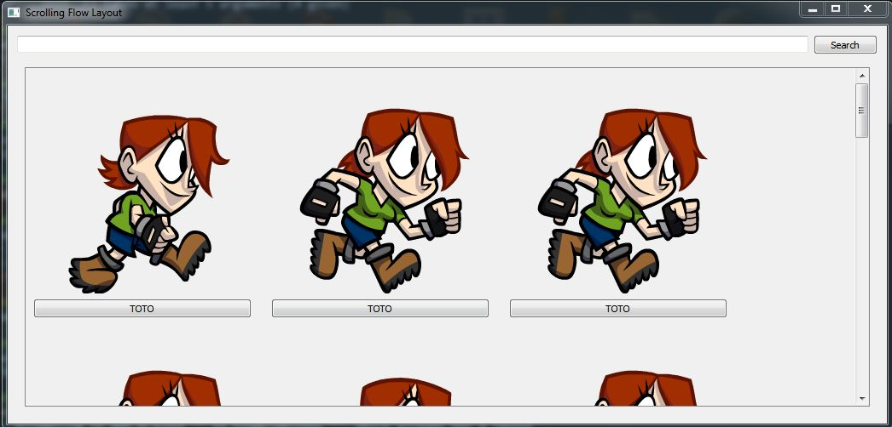

# A flowlayout with sprite item and search feature...

##ScreenShot

I use for animation.png

Exemple 
'''
class ExampleWindow(QtGui.QWidget):
        def __init__(self): 
            super(ExampleWindow, self).__init__()

            self.scroller = ExampleScroller(self)
            self.setLayout( QtGui.QVBoxLayout(self) )
            hlayout = QtGui.QHBoxLayout(self)
            self.button = QtGui.QPushButton("Search")
            self.button.pressed.connect(self.matchElem)
            self.edit = QtGui.QLineEdit()
            self.edit.editingFinished.connect(self.matchElem)
            hlayout.addWidget(self.edit)
            hlayout.addWidget(self.button) 
            self.layout().addLayout(hlayout)
            self.layout().addWidget(self.scroller)
            self.elem = {}
            for n in range(20):
                self.elem[n] = labelSprite("animation.png",256,256,"aaa")
                self.elem[n].itemSelected.connect(self.elemSelected)
                self.scroller.addWidget(self.elem[n])
'''
